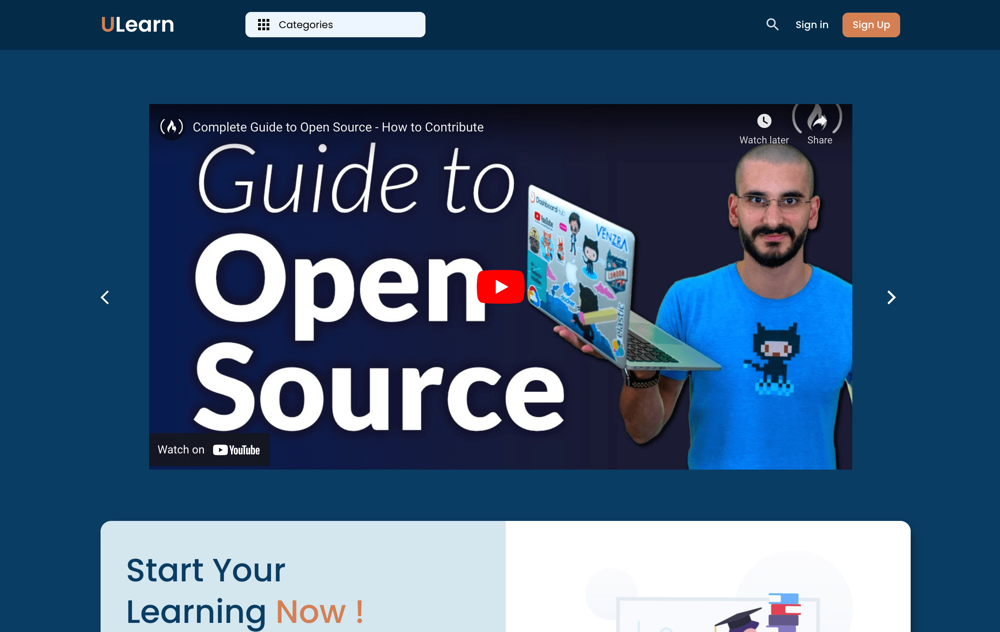
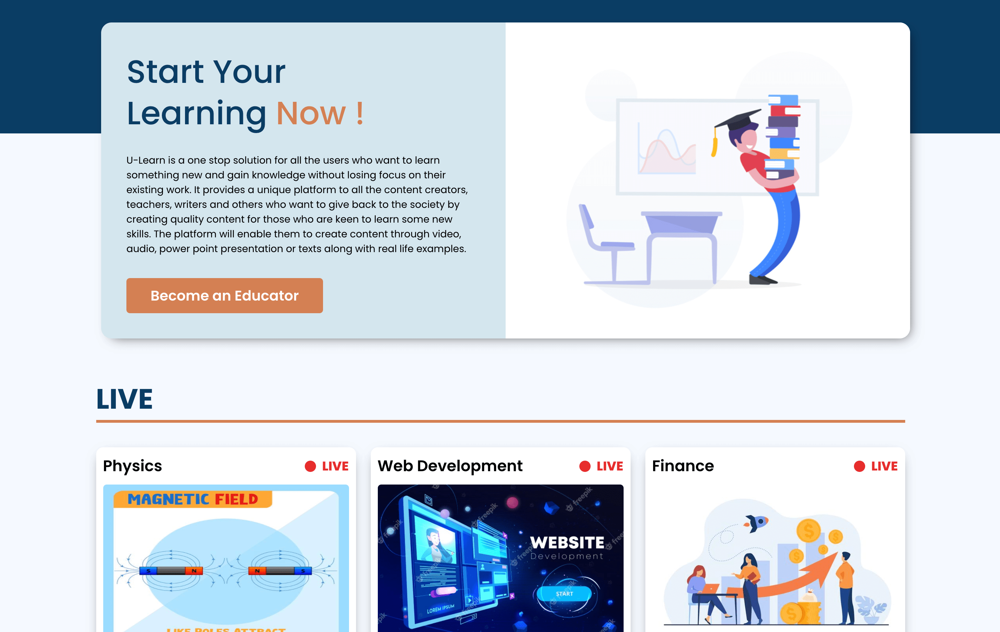
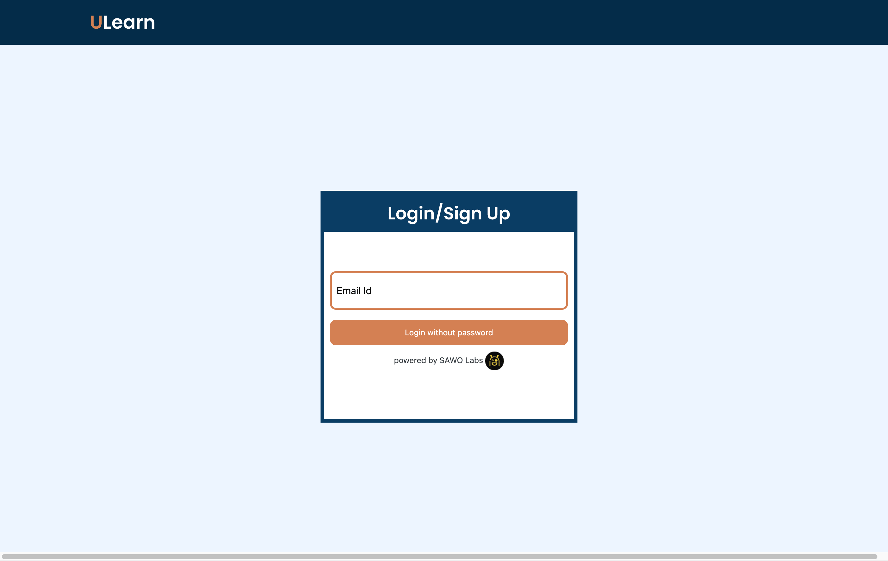

# ULearn - Learn in the way you want !

ULearn is a one-stop free solution for all the users who want to learn something new & gain knowledge without losing focus. It also provides a unique platform to all the content creators, teachers, writers and others who want to give back to the society by creating quality content for those who are keen to learn some new skills. The platform will enable them to create content through video, audio, power point presentation or texts along with real life examples.

This project was bootstrapped with [Create React App](https://github.com/facebook/create-react-app).

## Screenshots

### `npm start`

Runs the app in the development mode.\
Open [http://localhost:3000](http://localhost:3000) to view it in the browser.

### `npm run build`

Builds the app for production to the `build` folder.\
It correctly bundles React in production mode and optimizes the build for the best performance.

